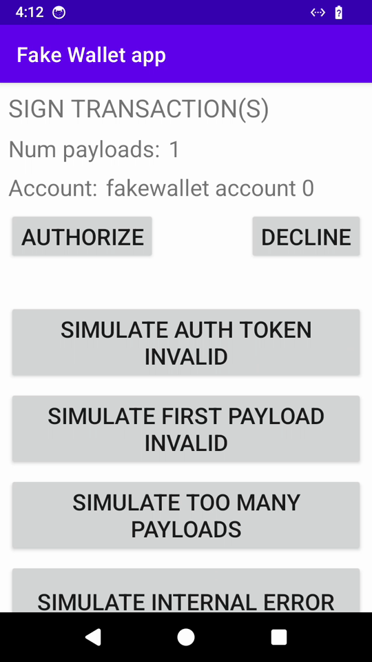

# Clock In Canvas

**One pixel a day, on-chain forever.** A pixel board for Seeker where your daily
check-in places one pixel. Every check-in is a real Solana transaction signed in your
wallet; the memo transaction set is the permanent on-chain record of who showed up,
where, and when.



Clock In Canvas is the mobile-native evolution of our earlier web experiment
[Cookie Canvas](https://loveoftheai.github.io/cookie-canvas) (per-pixel on-chain
provenance board): same idea — pixels as provable on-chain acts — rebuilt as a daily
ritual for the phone and the Seed Vault wallet.

**Demo video:** [`docs/demo.mp4`](docs/demo.mp4) (22s, one take) ·
**Pitch deck:** [`docs/deck.pdf`](docs/deck.pdf) ·
**APK:** [GitHub Release `v1.0.0-hackathon`](https://github.com/loveoftheai/clockin-canvas/releases/tag/v1.0.0-hackathon)

Streak apps die because check-ins live in someone's database. Clock In Canvas makes the
daily ritual itself the product: touch a cell, sign in your wallet, watch your pixel land.
Over a season the check-ins add up to a mural of everyone who showed up — and a daily
reason to open your Seed Vault wallet.

**Honest scope of this hackathon build (v1):** the memo transactions are submitted and
confirmed on devnet (fully real and auditable), and on connect the app rehydrates your
board and streak from your wallet's own memo history — restart-safe for your pixels.
What's still session-scoped: the board is per-wallet (you see your check-ins, not other
people's), and the daily rule is client-side. The shared cross-wallet board (Anchor
program) is milestone 1 of the roadmap.

## Why this is mobile-native

- **Touch-first 16×16 board** — big cells, one-thumb clock-in, not a desktop canvas ported down.
- **Seed Vault / Mobile Wallet Adapter** — sign-in and signing go through the native wallet
  flow (`mobile-wallet-adapter-protocol-web3js`), MWA v2 semantics.
- **A 20-second ritual** — open, tap, sign, done. Habit mechanics (streak, one-pixel-per-day)
  are the whole loop, built for the device you carry every day.

## The check-in transaction

Each clock-in is a signed memo transaction on devnet (mainnet support is planned, not
shipped — RPC and chain are devnet in v1) carrying the pixel payload:

```json
{ "app": "clockin", "x": 8, "y": 7, "c": "#ff9f1c", "d": "2026-09-26" }
```

Program: SPL Memo (`MemoSq4gqABAXKb96qnH8TysNcWxMyWCqXgDLGmfcHr`) — every check-in is
auditable on-chain with the wallet that placed it and the day it was placed. On connect
the app replays that history (`getSignaturesForAddress` → memo decode) to rebuild your
pixels and streak, so attendance survives reinstalls, not just sessions. The
one-transaction-per-wallet-per-day rule is enforced client-side in this build.

Demo clip: cold start → connect wallet (authorize sheet) → tap a cell → sign & send →
"confirmed on devnet" with the signature — the full MWA round-trip in 22 seconds. The demo
transaction was verified on the devnet explorer after the take.

## SKR / Seeker activity

Clock In Canvas is designed to feed the SKR activity flywheel: one signed on-chain
transaction per day (Onchain category), a daily open-and-tap ritual (Daily Use), and a
dApp Store release so check-ins count as dApp exploration (dApp Store publishing is on the
roadmap). The app's whole mechanic is "give Seeker owners a daily reason to transact from
their own wallet." Direct SKR program integration (earning/redeem flows) is roadmap work
once the program SDK is available to this build.

## AI

This project was built AI-first: architecture, MWA v2 wiring, UI, and the redroid-based
on-device UI automation that produced the demo take were all developed with AI agents
(Claude Code as the builder, Codex as the adversarial reviewer whose honesty pass is
reflected in this README). The concrete prompts, outputs, and agent-discovered defects —
including the Hermes toolchain blocker and the three MWA v2 signing rules the agents
derived from wallet-protocol source — are documented in
[`docs/ai-process.md`](docs/ai-process.md). Roadmap: on-device AI suggestions for the
daily pixel (spot in the mural with the most impact today).

## Evidence

- Demo transaction (the one recorded in `docs/demo.mp4`):
  [`2t4ijdFU…QzPs`](https://explorer.solana.com/tx/2t4ijdFUTU3q79Zg8gW7AZRwsaYetByomA3miEburQrf5SczSFsK5N1NACgrn6oNpvrMi8PqPE3p3oxzG1jyQzPs?cluster=devnet)
  on devnet — SPL Memo instruction `{app: clockin, x: 8, y: 7, c: #ff9f1c, d: 2026-09-26}`,
  paid and signed by the demo wallet `5cG5AtnH…WU6z` (the persistent fakewallet account
  used for the on-device take).
- Contract tests for the memo codec, day-collapse, and streak rehydration
  (`src/lib.ts` is shared by the app and the tests, not mirrored):

  ```bash
  npm test   # node --test, 7 tests
  ```

- Deck and demo clip: [`docs/`](docs/) (also linked from the hackathon
  submission).

## Tech

- Expo SDK 57 / React Native 0.86 / React 19 — TypeScript throughout
- `@solana-mobile/mobile-wallet-adapter-protocol-web3js` — authorize + sign-and-send
  (same-session reauthorize for the privileged sign method, `chain: solana:devnet`)
- `@solana/web3.js` — legacy memo transaction, devnet RPC

### Build

```bash
npm install
npx tsc --noEmit
cd android && ./gradlew :app:assembleRelease   # android/app/build/outputs/apk/release/app-release.apk
```

Requires JDK 17 and an Android SDK; the APK installs on any arm64 Android device or emulator.

### Try the release APK

1. Install
   [`app-release.apk`](https://github.com/loveoftheai/clockin-canvas/releases/download/v1.0.0-hackathon/app-release.apk)
   (`adb install app-release.apk`, or download on-device).
2. Open any Mobile Wallet Adapter wallet (Solflare / Phantom mobile / Backpack; the demo
   used the reference `fakewallet` build) and fund it on devnet — any devnet faucet.
3. In Clock In Canvas: **Connect** → authorize → tap any cell → **Sign & Send** →
   the pixel lands and the explorer link with the signature appears.

## Roadmap

1. On-chain board state (Anchor program) — pixels live in program accounts and the board
   renders from chain for every wallet, not just your own history
2. dApp Store release (create-dapp-store, publishing approval)
3. Season 1 — timed boards, mural mint at season end, creator boards for communities

Shipped after the first cut: streak + board rehydration from wallet history
(`getSignaturesForAddress` → SPL Memo replay).

## License

MIT
